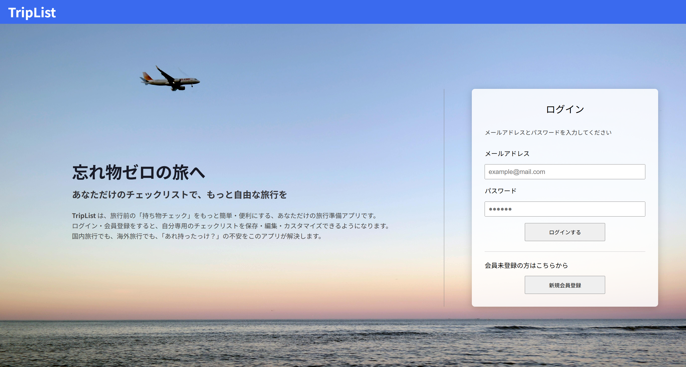

# 【TripList】サポーターズ主催 技育CAMP2025 ハッカソン Vol.4 提出作品

## 作品概要

**「忘れ物ゼロの旅へ」** をコンセプトにした旅行時の必要な荷物を管理するためのアプリ



## 使用技術


> [!WARNING]
> **コマンドのパスはMac用なのでWindowsの場合は適宜変更してください**

## フロントエンド側の環境構築

### フロントエンドの起動方法

リポジトリのクローン

```
git clone https://github.com/tea35/trip.git
```

frontendディレクトリへ移動

```
cd trip/frontend
```

npmのインストール

```
npm install
```

アプリの起動

```
npm start
```


## バックエンド側の環境構築

### 設定ファイルを使う場合

```
conda env create -n triplist -f config/env_triplist.yaml
```

### 初めから作る場合

Python環境構築

```
conda create -n triplist python=3.10
```

環境起動

```
conda activate triplist
```

Flaskのインストール

```
pip install flask flask-cors
```

```
pip install flask-sqlalchemy flask-migrate
```

### 動作確認

```
python3 backend/sample.py
```

## データベース関連

### SQLiteの設定

- [SQLite公式](https://www.sqlite.org/download.html)から`sqlite-tools-win-x64-3490200.zip`をインストールする
  
- 展開して中のファイルを全て`database`ディレクトリに移動する

```
.
└── triplist
    └── backend
        └── database
            ├── sqldiff.exe
            ├── sqlite3_analyzer.exe
            ├── sqlite3_rsync.exe
            └── sqlite3.exe
```

### データベースの構造

`backend/database/triplist.db`内に`members`、`triplist`、`checklist`テーブルの３つがある

#### members

| 変数名 | 型 |
| ---- | ---- |
| id | INTEGER (PRIMARY KEY AUTOINCREMENT) |
| email | TEXT (UNIQUE NOT NULL) |
| password | TEXT (NOT NULL) |

#### triplist

| 変数名 | 型 |
| ---- | ---- |
| user | TEXT (NOT NULL) |
| location_name | TEXT (NOT NULL) |
| location_latitude | REAL |
| location_longitude | REAL |
| first_date | TEXT (NOT NULL) |
| last_date | TEXT (NOT NULL) |
| trip_id | INTEGER (PRIMARY KEY AUTOINCREMENT) |

#### checklist

| 変数名 | 型 |
| ---- | ---- |
| checklist_id | INTEGER (FOREIGN KEY → triplist.trip_id, ON DELETE CASCADE) |
| item_name | TEXT (NOT NULL) |
| item_num | INTEGER |
| check_bool | INTEGER |
| item_id | INTEGER (PRIMARY KEY AUTOINCREMENT) |


## API関連

### Flaskサーバー起動方法

**Mac**
```
python3 backend/main.py
```

**Windows**
```
python backend\main.py
```

### ダミーデータの生成

> [!TIP]
> Flaskサーバー起動時にデータベース、テーブルは自動で作成されるがからのデータなのでダミーデータを挿入する
>
> データの型の詳細は```backend/database/create_db.py```を参照

```
python backend/database/insert_dummydata.py   
```

### API検証方法

> [!IMPORTANT]
> Flaskサーバー起動時に使ったターミナルとは別のターミナルで行う


#### 会員登録関連

テーブル名：```members```

##### 会員登録用API（register_API.py）

```
curl -X POST http://127.0.0.1:5000/register \
    -H "Content-Type: application/json" \
    -d '{"email":"test@example.com", "password":"secret"}'
```

##### ログイン用API（login_API.py）

```
curl -X POST http://127.0.0.1:5000/login \
    -H "Content-Type: application/json" \
    -d '{"email":"test@example.com", "password":"secret"}'
```

#### 旅行全体リスト関連

テーブル名：```triplist```

##### 追加用API（add_triplist_API.py）

```
curl -X POST http://127.0.0.1:5000/triplist \
    -H "Content-Type: application/json" \
    -d '{"user":"test@example.com", "location_name":"東京", "location_latitude":35.6895, "location_longitude":139.6917, "first_date":"2025-12-24", "last_date":"2025-12-27"}'
```

##### 取得用API（get_triplist_API.py）

```
curl "http://127.0.0.1:5000/triplist?user=user1@example.com"
```

##### 削除用API（delete_triplist_API.py）

```
curl -X DELETE http://127.0.0.1:5000/triplist/3
```

#### チェックリスト関連

テーブル名：```checklist```

##### 追加用API（add_item_API.py）

```
curl -X POST http://127.0.0.1:5000/item \
    -H "Content-Type: application/json" \
    -d '{"checklist_id":1, "item_name":"服", "item_num":3, "check_bool":"False"}'
```

##### 取得用API（get_item_API.py）

```
curl "http://127.0.0.1:5000/item?checklist_id=1"
```

##### 削除用API（delete_item_API.py）

```
curl -X DELETE http://127.0.0.1:5000/item/2
```

##### 更新用API（update_item_API.py）

```
curl -X PUT http://127.0.0.1:5000/item \
    -H "Content-Type: application/json" \
    -d '{
        "checklist_id": 1,
        "items": [
            {"item_name":"Item_1", "item_id": 1, "item_num": 10, "check_bool": 1},
            {"item_name":"Item_2", "item_id": 2, "item_num": 5, "check_bool": 0}
        ]
    }'
```